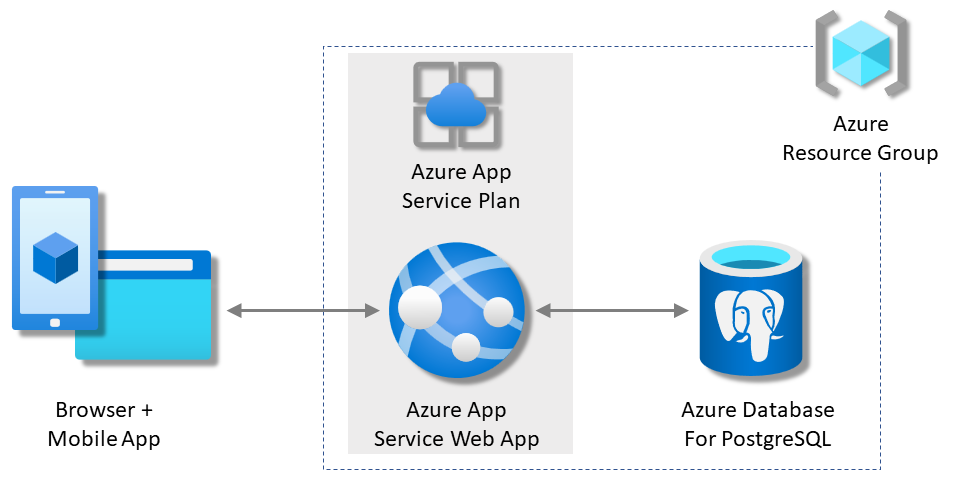

# Deploy a Python Flask web app with PostgreSQL on Azure

In this tutorial, you'll deploy a Flask Python web app to Azure App Service with the Azure Database for PostgreSQL service.

Step 0. [Prepare Azure subscription and resource group](./Step.0/Prepare_Azure_subscription_and_resource_group.md) 
Step 1. [Create PostgreSQL database](./Step.1/Create_PostgreSQL_database.md) 
Step 2. [Create Web App](./Step.2/Create_Web_App.md) 
Step 3. [Deploy code from GitHub](./Step.3/Deploy_code_from_GitHub.md) 
Step 4. [Run the app](./Step.4/Run_the_app.md) 
Step 5. [View log](./Step.5/View_log.md) 
Step 6. [Modify the app](./Step.6/Modify_the_app.md) 
