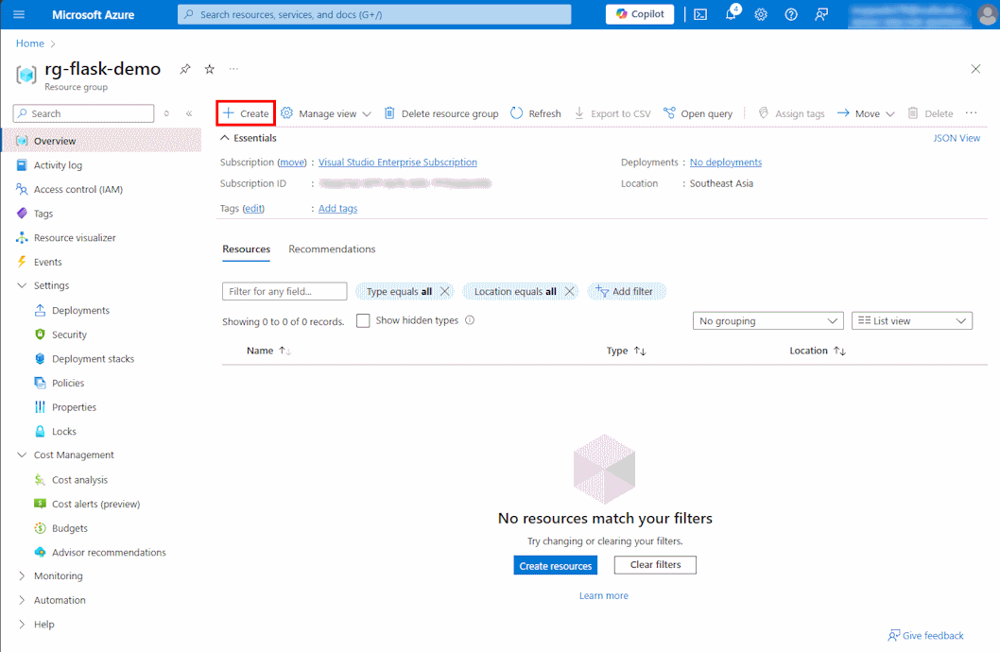

## In the resource group page
click `+ Create`  

 
 

## Create a new resource group
1. Type "resource groups" on the top search bar, and select `Resource groups`
   
   
2. Select `Create`. 
   
  
4. Enter the following values:
   * Subscription:  Select your Azure subscription.
   * Resource group:  Enter a new resource group name, ex. `rg-flask-demo`.
   * Region:  Select an Azure location, such as `Southeast Asia`. 
   

5. Select `Review + Create`

6. Click `Create`. It takes a few seconds to create a resource group. 
   
 

The new resource group will be shown in the list. 

**[Home](../README.md)** - [Next step >](../Step.1/Create_PostgreSQL_database.md)

