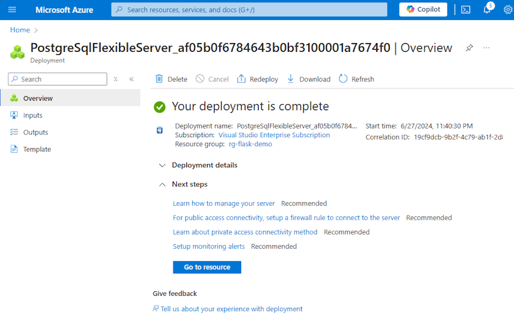

## In the resource group page
Click `+ Create`  

 
 

## Create a new Azure Database for PostgreSQL Flexible server
1. Type `postgres flexible` on the search bar, and select `create` inside **Azure Database for PostgreSQL Flexible server** box.
   
   
2. Enter the following values: 

   ***Project details*** 
   * **Subscription:**  Select your Azure subscription.
   * **Resource group:**  Select your resource group, ex. `rg-flask-demo`.

   ***Server details*** 
   * **Server name:**  Enter a new server, ex. `db-flask-demo`.
   * **Region:**  Select an Azure location, such as `Southeast Asia`.
   * **Workload type:**  Select `Development`.

   ***Authentication*** 
   * **Authentication method:**  Select `PostgreSQL authentication only`.
   * **Admin username:**  Enter username, ex. `dbadmin`.
   * **Password:**  Enter password.
   * **Confirm password:**  Enter password.

   

3. Select `Review + Create` 

4. Click `Create`.  
   

5. Click `Create server without firewall rules`. 
   *(For this demo, we will ignore about security practice.)* 

   

6. Wait a few minutes until the PostgreSQL will be created. 
   

[< Previous step ](../Step.0/Prepare_Azure_subscription_and_resource_group.md) &emsp; - &emsp; **[Home](../README.md)** &emsp; - &emsp; [Next step >](../Step.2/Create_Web_App.md)

