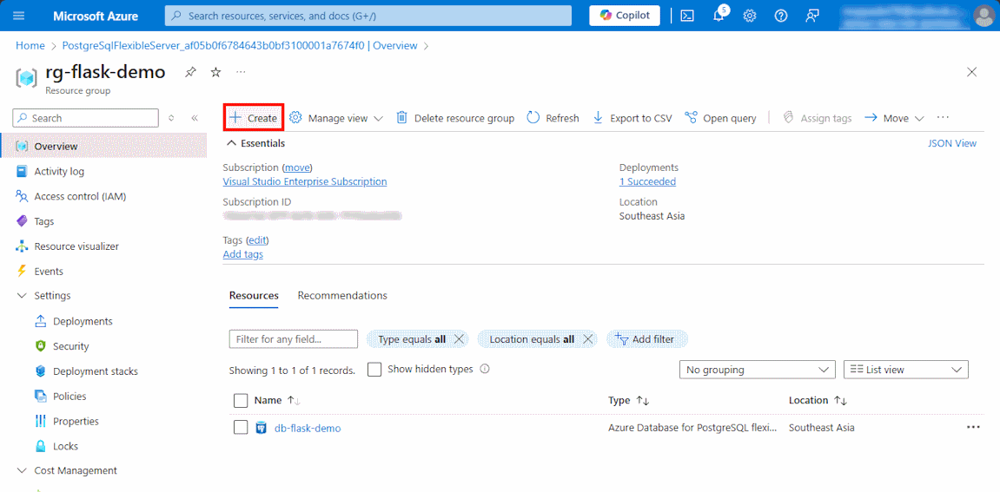
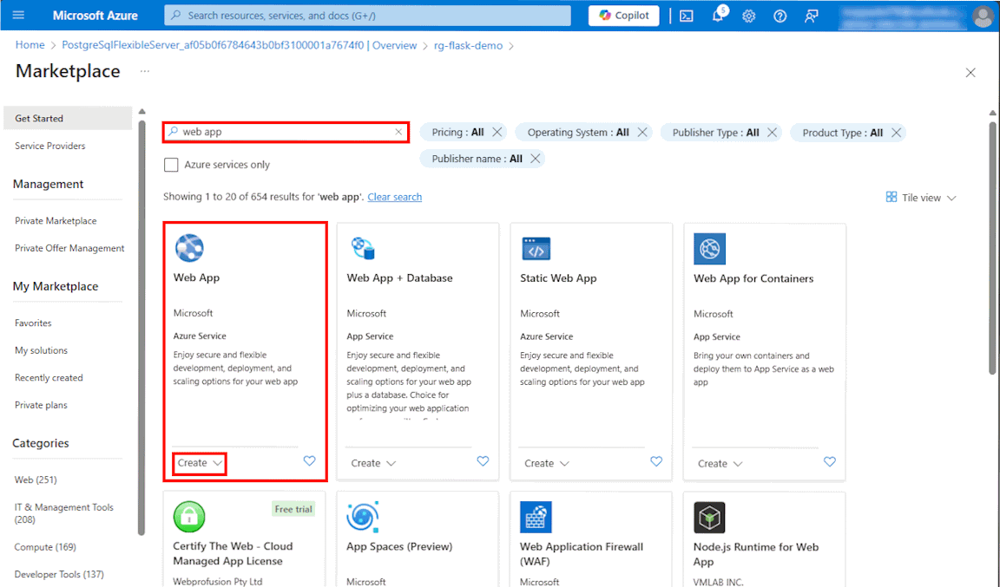
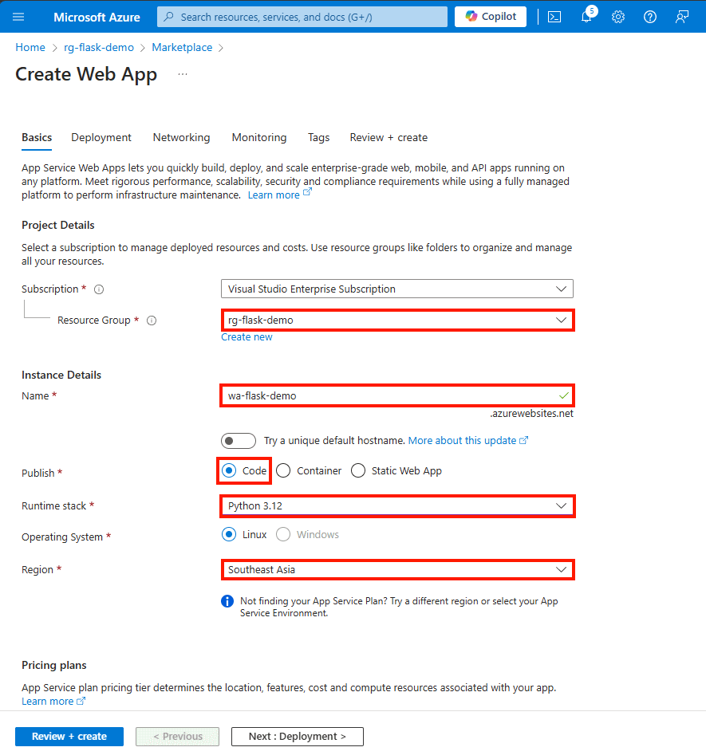
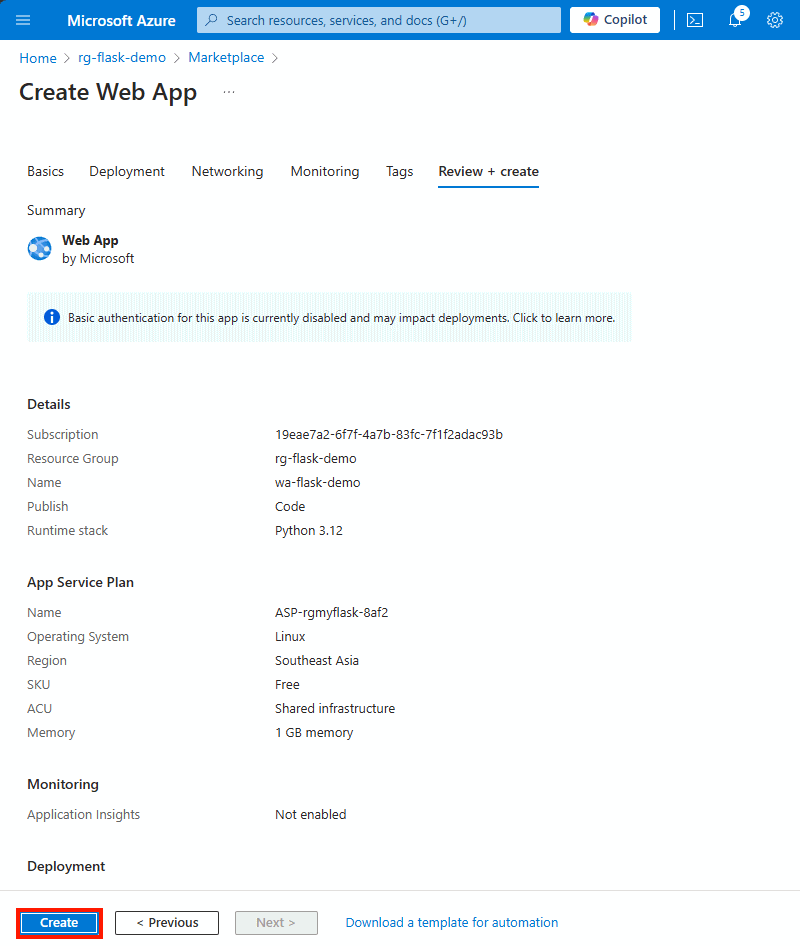
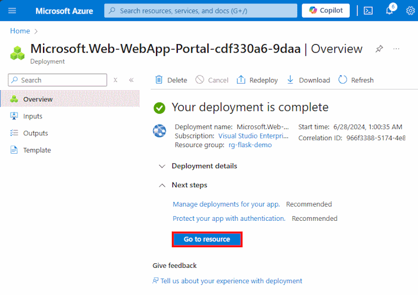

## In the resource group page
Click `+ Create`  

 
 

## Create a new Web App
1. Type `web app` on the search bar, and select `create` inside **Web App** box.
   
   
2. Enter the following values: 

   ***Project details*** 
   * **Subscription:**  Select your Azure subscription.
   * **Resource group:**  Select your resource group, ex. `rg-flask-demo`.

   ***Instance details*** 
   * **Name:**  Enter a new web app name. (Must not be the same as an existing name)
   * **Publish:**  Select `Code`.
   * **Runtime stack:**  Select `Python 3.12`.
   * **Region:**  Select an Azure location, such as `Southeast Asia`.

   

3. Select `Review + Create` 

4. Click `Create`.  
   

5. Wait a minute until the web app will be created. 
   Then Click `Go to resource`.

   

[< Previous step ](../Step.1/Create_PostgreSQL_database.md) &emsp; - &emsp; **[Home](../README.md)** &emsp; - &emsp; [Next step >](../Step.3/Deploy_code_from_GitHub.md)

