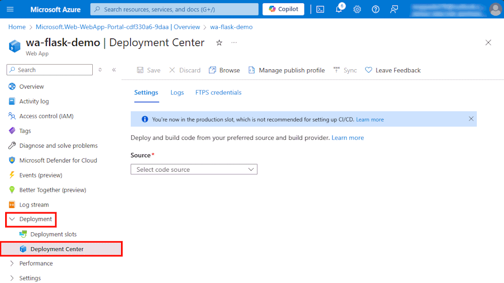

## Fork the demo code
1. Sign in to your GitHub account.
2. Navigate to https://github.com/Azure-Samples/msdocs-flask-postgresql-sample-app.
3. Select `Fork`.
4. Select `Create Fork`.

## In the Web App page
1. Select `Settings` > `Environment variables`.  
2. In `App Settings` , click `+ Add`.

3. Enter the following values: 
   **Name**: `AZURE_POSTGRESQL_CONNECTIONSTRING` 
   **Value**: `dbname=python-postgres-database host=<POSTGRESQL_NAME>.postgres.database.azure.com port=5432 sslmode=require user=<USERNAME> password=<PASSWORD>`

4. Click `Apply`.

5. Click `Apply` on **App Setting** page

 

## In the Deployment Center page
Select `Deployment` > `Deployment Center`  

 

Enter the following values: 

1. **Source**: select `GitHub`. 
   By default, **GitHub Actions** is selected as the build provider.

2. Sign in to your GitHub account and follow the prompt to authorize Azure.

3. **Organization**: select your account.

4. **Repository**: select `msdocs-flask-postgresql-sample-app`.

5. **Branch**: select `main`.

6. In the top menu, select `Save`. 
   App Service commits a workflow file into the chosen GitHub repository, in the `.github/workflows` directory.

7. Select `Logs`. A deployment run is already started.

8. In the log item for the deployment run, select `Build/Deploy Logs`. 
   

9. You're taken to your GitHub repository and see that the GitHub action is running. The workflow file defines two separate stages, build and deploy. Wait for the GitHub run to show a status of **Complete**. It takes about 5 minutes. 
If the GitHub Action workflow job failed, try re-run the jobs again.

   

## Generate database schema
The easiest way to run Flask database migrations is in an SSH session with the App Service container.

1. In the App Service page, select `Development Tools` > `SSH`.

2. Click `Go`

   

3.  In the SSH terminal, run `flask db upgrade`.  
    If it succeeds, App Service is connecting successfully to the database.  
    Only changes to files in /home can persist beyond app restarts. Changes outside of /home aren't persisted.

4. Click `Create`.  
   

5. Wait a minute until the web app will be created. 
   Then Click `Go to resource`.

   

[< Previous step ](../Step.1/Create_PostgreSQL_database.md) &emsp; - &emsp; **[Home](../README.md)** &emsp; - &emsp; [Next step >](../Step.3/Deploy_code_from_GitHub.md)

